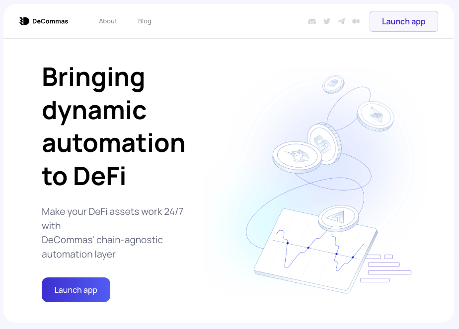
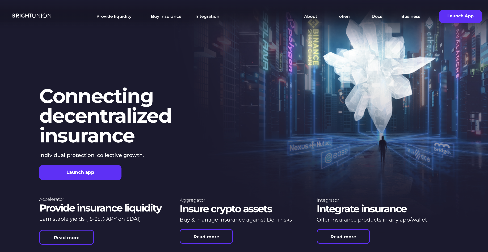
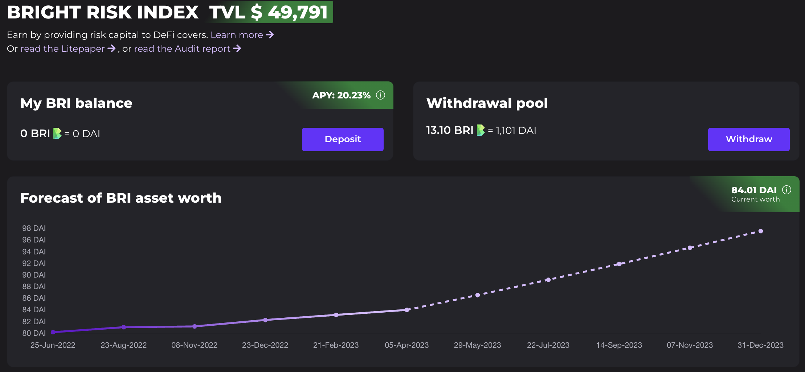

[Decommas.io](https://decommas.io/) 

---

- Decommas is the decentralized initiative of [3commas.io](https://3commas.io/). 3Commas market offers trading bots for centralize exchanges. As part of the solidity research team we develop a cross-chain trading strategy using protocols like Startgate, Layer Zero, Aave, Gmx, Perpetual and UniswapV2 & v3. The cross-chain product is still not public but you can read further references here:
  - [Dapp](https://app.decommas.io/strategies)
  - [Docs](https://medium.com/@DeCommas/new-meta-automating-basis-trading-852c2f08cc44)
  - [Contract](https://optimistic.etherscan.io/address/0x3E818Baf68F6465b2d97604f072CE6E402B906F7)
 

[BrightUnion.io](https://brightunion.io/)

---

- Bright Union stands mainly as a decentralized insurance aggregator. While working with them I was able to contribute to the development of an investment token, an npm SDK package to integrate crypto coverage into Dapps and a subgraph using the graph protocol. 
- These are further references to each one of the products:

  - [BRI](https://app.brightunion.io/provide-cover) Bright Risk Index Token: Staking protocol that yields earnings by providing stable assets liquidity to an index of third-party insurance pools. So far the main partners are Nexus Mutual, Bridge Mutual and Insurace. You can read more at the [lite paper](https://brightunion.io/documents/BRI_litepaper.pdf?_gl=1*1ibgj69*_ga*MTgxNzg5NTc4OC4xNjc4Mjk1ODY1*_ga_KCNQQRKDP7*MTY3OTYwODI3NC4zLjEuMTY3OTYwODQxMy4wLjAuMA..), [contract](https://etherscan.io/address/0xa4b032895BcB6B11ec7d21380f557919D448FD04), and [audit report](https://app.inspex.co/library/bright-union) by inspex.co.

  - [Bright Union SDK](https://www.npmjs.com/package/@brightunion/sdk) This is a set of javascript utilities that enables easy integration of Bright Union's multi-chain protocol into any web project.
  - [Subgraph](https://thegraph.com/explorer/subgraphs/E3DjinJzLKLQsV5zusDgMML3y9VBr1Pm5Xw3kXdvU9yP?view=Overview&chain=mainnet) The purpose of the subgraph is to query and analyze the BRI contract events and be able to display its performance and a possible forecast in the market.
  - 

 
